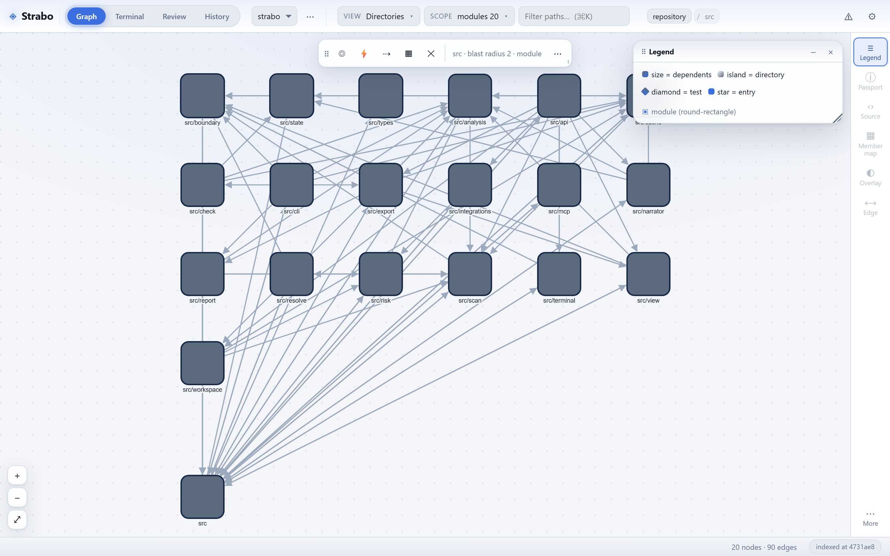
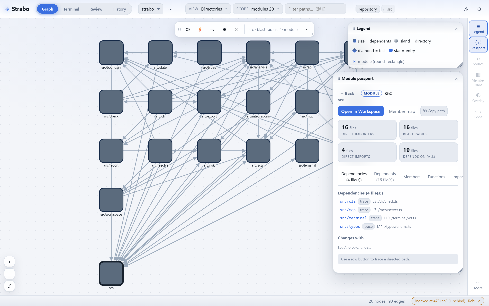

# Strabo

[](https://www.npmjs.com/package/strabo-map)
[](https://github.com/ArtemKunik/strabo/actions/workflows/ci.yml)
[](LICENSE)
[](package.json)

A standalone app for understanding repository structure, dependencies, and change impact.

Strabo turns a local source repository into an interactive map of its files and
dependencies. Engineers explore the structure, trace relationships, and inspect the
source evidence behind every connection.



*The map of `src`: each box is a directory sized by its dependents, each arrow a recorded
import. Select a module to open its passport.*

> **Guiding principle: evidence over speculation.**
> The map draws only edges it can resolve inside the repository. Anything uncertain is
> reported as a diagnostic, never invented as a link.

## Status

Implemented and running: scanner, resolvers, graph cache, HTTP API, and the browser app,
including review overlays, the Change impact passport, the Module Passport, the Member map,
the Repository passport, Git review, branch review and actions, workspace analysis,
dependency risk, and the opt-in narrator. Design internals
and the deliberately parked surface live in [docs/DESIGN.md](docs/DESIGN.md); the phased
plan and what is still pending live in [docs/ROADMAP.md](docs/ROADMAP.md).

## Install and run

Requires Node 22+. Strabo is published to npm as `strabo-map`; the command it installs is
`strabo`:

```sh
npx strabo-map /path/to/repo     # try it without installing
npm install -g strabo-map        # or install it, then:
strabo /path/to/repo             # maps that repository; omit the path to map the current one
```

Open `http://localhost:3000`. The in-app Terminal uses the optional native module
`node-pty`; if it cannot be built on your machine, everything else still works.

From a clone of this repository:

```sh
npm install          # also builds dist/ and vendors the parser .wasm files (prepare)
npm start            # maps the repository you are standing in
npm start -- /path/to/repo
```

The root is resolved from the path argument, then `STRABO_ROOT`, then the working
directory. Configuration, the environment table, the repository picker, and Settings are
in [docs/USAGE.md](docs/USAGE.md).

## Features

- **Reading the map** — size, position, shape, and status encode the graph; floating
  panels, the Module Passport, the Functions tab, edge evidence, the Member map, and the
  recorded function-call view. See [docs/FEATURES.md](docs/FEATURES.md#reading-the-map).
- **Blocks (Lego view)** — the map on screen as a brick assembly: bricks stack by dependency
  depth, studs are the recorded dependents, and cycles, load-bearing bricks, and detached
  bricks are named as refactoring notes.
  See [docs/FEATURES.md](docs/FEATURES.md#floating-panels).
- **Review overlays** — change impact, cycles, test reach, module depth, ownership,
  architecture health, and function hotspots annotate the map from recorded analysis.
  See [docs/FEATURES.md](docs/FEATURES.md#review-overlays).
- **Repository passport** — a first-visit summary of languages, entry points, top-level
  directories, fan-in, cycles, and untested modules, from the same graph the canvas draws.
  See [docs/FEATURES.md](docs/FEATURES.md#repository-passport).
- **Git review** — pending and per-commit review with statuses, line counts, and
  reverse-reachability impact. See [docs/FEATURES.md](docs/FEATURES.md#git-review).
- **Reviewing an agent's change** — a scope fence (`--expect`) that lists changes outside a
  declared zone and inside changes imported from outside, a public API diff between two
  revisions, and clone clusters from normalised function bodies.
  See [docs/CLI.md](docs/CLI.md#change-report-scope-fence-and-public-api).
- **Hidden connections and declared architecture** — environment variables, HTTP routes
  declared and called, and feature flags as edges, plus `strabo.rules` intent that
  `strabo check --fail-on` enforces.
- **Architecture drift** — one structural measure per cached revision, drawn as a timeline.
  See [docs/ROADMAP.md](docs/ROADMAP.md).
- **Source viewer** — read one file or a unified diff inline, at HEAD or a past revision.
  See [docs/FEATURES.md](docs/FEATURES.md#source-viewer).
- **Change impact passport** — a bounded risk score, complexity move, coherence, blast
  radius, and recorded signals for each changed file.
  See [docs/FEATURES.md](docs/FEATURES.md#change-impact-passport).
- **Branches** — list, fetch, push/publish, and sync, through explicit, validated buttons.
  See [docs/FEATURES.md](docs/FEATURES.md#branches).
- **Workspace analysis** — cross-repo package and service flows, shared data contracts and
  drift, plus schema snapshots, compatibility, migration preflight, and a live read-only
  probe. See [docs/FEATURES.md](docs/FEATURES.md#workspace-analysis).
- **Dependency risk** — inventory and file mapping always; advisories and licenses through
  the opt-in OSV.dev / deps.dev lookup.
  See [docs/FEATURES.md](docs/FEATURES.md#dependency-risk).
- **Delegate to an agent** — hand a node, edge, commit, or review to `opencode` or `claude`
  in an interactive TUI, seeded with the recorded evidence.
  See [docs/FEATURES.md](docs/FEATURES.md#delegate-to-an-agent).
- **Commit and narrator (opt-in)** — a commit message written from recorded changes, and a
  narrative layer over evidence, both inert until configured.
  See [docs/FEATURES.md](docs/FEATURES.md#commit-narrator-opt-in) and
  [docs/FEATURES.md](docs/FEATURES.md#llm-narrator-opt-in).

### A closer look

Selecting a module opens its passport: direct importers, blast radius, the dependencies it
records with their source evidence, and the panels one step from there.



## How it works

```mermaid
flowchart TD
    boundary["Repository boundary — resolveRepositoryRoot + scanCeiling"]
    scanner["Scanner — JS/TS and polyglot resolvers"]
    graph["Graph contract — nodes · edges · diagnostics · excluded"]
    cache[("Graph cache — memory + disk artifact")]
    analysis["Analysis & layout — impact · cycles · blocks · depth · ownership · passports"]
    api["HTTP API — /api/strabo"]
    ui["Browser app — Cytoscape map · floating panels"]
    headless["Headless — export · check · report · MCP"]

    boundary --> scanner --> graph
    graph --> cache
    graph --> analysis
    cache --> api
    analysis --> api
    api --> ui
    graph --> headless
```

Every surface reads the same recorded graph: the map, the headless reports, and the MCP
tools. Anything the scan cannot resolve stays a diagnostic, never an invented edge.

## Headless use

The same scan backs a CLI and an agent tool surface: `strabo export`, `strabo check`,
`strabo report`, and `strabo mcp`. See [docs/CLI.md](docs/CLI.md); the MCP tools and their
read-only boundary are in [docs/MCP.md](docs/MCP.md).

## Docs

| Document | Covers |
| -------- | ------ |
| [docs/USAGE.md](docs/USAGE.md) | Install, run, environment, repository picker, Settings |
| [docs/FEATURES.md](docs/FEATURES.md) | The map and every panel, with the evidence each reads |
| [docs/CLI.md](docs/CLI.md) | `export`, `check`, `report`, `summary`, and MCP |
| [docs/MCP.md](docs/MCP.md) | MCP client config, tools, and the read-only boundary |
| [docs/DESIGN.md](docs/DESIGN.md) | Boundary, architecture, graph contract, parsers, layout, non-goals |
| [docs/ROADMAP.md](docs/ROADMAP.md) | The phased plan and what is still pending |
| [docs/PROVENANCE.md](docs/PROVENANCE.md) | Dependency and asset provenance |

## Tests

```sh
npm test              # unit tests (Node's built-in runner, no browser)
npm run test:coverage # unit tests plus coverage/lcov.info, which Strabo reads on itself
npm run acceptance:install   # once: download Chromium
npm run acceptance    # Cucumber + Playwright, writes an HTML report with screenshots
npm run test:pack     # release readiness: pack, install in a clean consumer, run shipped code
```

The unit suite runs entirely in Node, and the DOM panels are covered through jsdom
(`test/unit/panels.test.ts`). Browser acceptance lives in `test/acceptance/`; see
[test/acceptance/README.md](test/acceptance/README.md).

## Internals and design

The repository boundary, architecture, graph contract, parser resolution rules, source
layout, entry-point detection, non-goals, and the deliberately parked surface are
documented in [docs/DESIGN.md](docs/DESIGN.md), kept apart from shipped behaviour so a
designed surface is never documented as if it resolves.

## License

[MIT](LICENSE)
